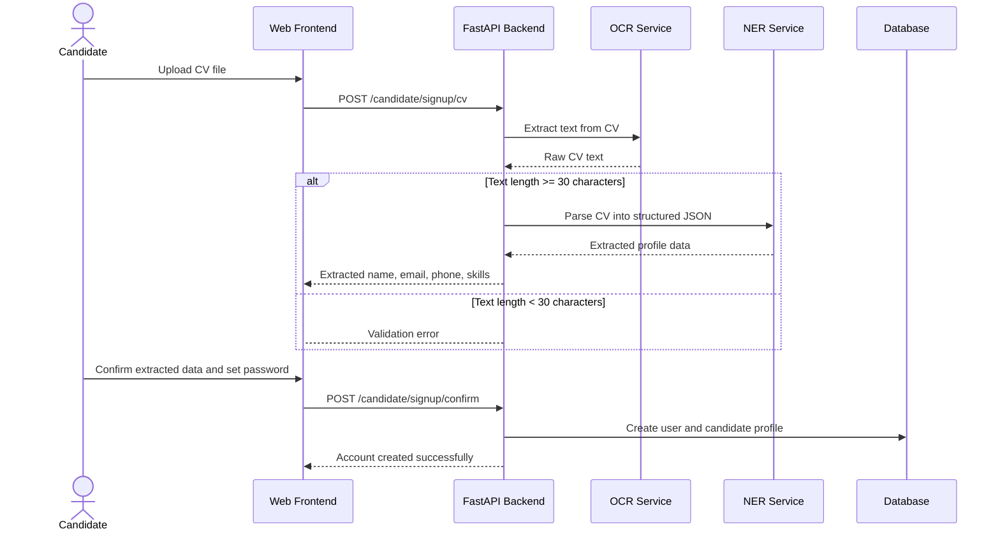

## Arrow Legend for Mermaid Sequence Diagrams

- **`->>`** solid line with filled arrowhead: response/return with data payload
- **`-->`** dashed line, no arrowhead: async response or informational message (empty)
- **`->>`** solid line to participant: synchronous call
- **`-->`** dashed line to participant: asynchronous call

**Changes made:**
- `API-->Frontend: Validation error` — Changed to dashed arrow (no data payload, just an error notification)
- `API-->>Frontend: Account created successfully` — Kept solid filled arrow (response contains success confirmation)
